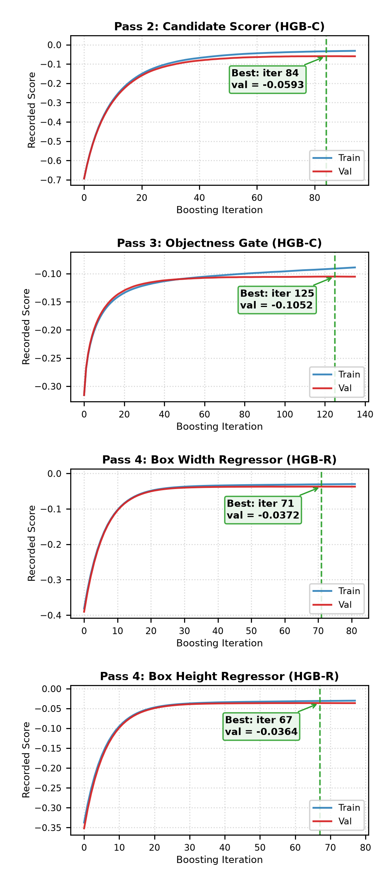
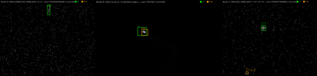

# OrbitSight — Real-Time RSO Detection from Neuromorphic Event Streams
**TII OrbitSight Challenge · Technical Proposal · Team `OrbitAI`**

## 1. Problem Statement and Solution

Neuromorphic vision sensors observing resident space objects produce sparse, asynchronous event streams in which a target may generate only a handful of events per 40 ms window, embedded in star fields, hot pixels and sensor noise. The problem is not classification capacity — it is **ranking a very small number of true detections above a very large number of plausible noise components**, under a strict IoU ≥ 0.5 requirement, in real time, on CPU.

OrbitSight is a four-pass event-native pipeline: connected-component candidate proposal on per-window event count maps, a learned candidate scorer over 13 features, a learned window-level objectness gate over 21 features spanning three consecutive windows, and a post-hoc bounding-box regressor that corrects box dimensions without disturbing detection ranking. It ships as a self-contained offline Docker image that reads `/OrbitSight_dataset`, requires no network, and writes conformant `.txt` predictions plus `Evaluation_Metrics.xlsx` to `/work/OrbitAI/DDMMYYYY`.

## 2. Outcome Metrics

All figures below were produced by the submitted container running offline and verified against the challenge's own `evaluate.py`: precision, recall, F1 and the TP/FP/FN counts match exactly at absolute difference 0, and mAP to **5.55e-17**. Every accuracy claim here is expressed in the evaluator's own terms.

### 2.1 Detection accuracy

| Split | mAP@0.5 | Precision | Recall | F1 | TP | FP | FN |
|---|---|---|---|---|---|---|---|
| All 21 sequences | **0.284406** | 0.623120 | 0.472327 | 0.537345 | 10,565 | 6,390 | 11,803 |
| Train (17, selection) | 0.258616 | 0.580217 | 0.454551 | 0.509754 | 6,951 | 5,029 | 8,341 |
| Test (4, derived) | **0.394014** | 0.726432 | 0.510740 | 0.599784 | 3,614 | 1,361 | 3,462 |

Configuration selection used the 17 training sequences exclusively; the four test sequences are reported by subtraction and were never used to choose a configuration.

### 2.2 Real-time performance

Latency was measured with a dedicated streaming benchmark timing the full per-window pipeline — proposal, features, both learned models, NMS, gating, top-K and box regression — over five repetitions, discarding 20 warm-up windows per sequence.

**Neither machine available to us is the evaluation platform.** Machine A is an Intel Core i5-7200U (2 cores, 15 W, Kaby Lake); Machine B an Intel Core i7-10870H (8 cores, 45 W, Comet Lake, 16 MB L3). Both are Skylake-derived. The evaluation platform's i9-12900H uses Golden Cove cores with materially higher IPC at comparable frequency, so **every figure below is a conservative upper bound** on the latency the evaluator will observe. We make no compliance claim for hardware we have not measured.

| Criterion (17 training sequences, commit `583f4bf`) | Machine A | Machine B |
|---|---|---|
| Compute p99 < 40 ms | 15 of 17 | **17 of 17** |
| Worst-case single window < 40 ms | 2 of 17 | **14 of 17** |
| Windows exceeding 1,000 ms | 5 | **0** |

On Machine B, across 105,852 timed windows, compute p99 ranges from 4.93 ms (`DAVIS_Filtered_NOAA6`) to 31.34 ms (`EVK4_mag5.2`); the three worst-case exceedances are 41.89, 43.09 and 51.80 ms. Both machines were measured natively on Windows at the same commit. Resident memory stays within 114.3–130.7 MB.

**End-to-end latency remains above budget on every sequence, by construction.** The detector consumes one window of lookahead, so end-to-end latency is exactly compute latency plus one 40 ms window period; no hardware brings this below 40 ms. A causal variant removing the lookahead was implemented and evaluated: it reduced overall mAP by 16.1% and sparse-sequence mAP by 48.0%, and was rejected on accuracy grounds. Closing this gap without that penalty is the most valuable item of future work.

An advance prediction that EVK4 sequences would gain disproportionately from Machine B's larger L3 cache was recorded before measurement and **failed**: EVK4 improved 1.98× against 2.87× for DAVIS. The observed ratio instead tracks the memory-bandwidth ratio between the machines (~1.38×), indicating that large-sensor cost is bandwidth-bound rather than cache-resident.

### 2.3 Generalisation

The box regressor converts false positives into true positives at almost identical rates on data it was selected on and data it was not: **15.8%** on the training split (1,891 of 11,980 detections) and **16.0%** on the test split (797 of 4,975), a net **+2,688 true positives** at a constant 16,955 total detections. The gain is largest exactly where the baseline was weakest — on the ten sparse sequences (GT ≤ 43 boxes) mAP rises 0.100600 → 0.226600, **+125.2%**; on the seven dense sequences 0.257257 → 0.304353, +18.3%.

## 3. Value Proposition and Competitive Positioning

**Every number is reproducible, and the artifact is the evidence.** Six container runs produced identical detection counts, the image is built from the exact commit in the repository, and in-process metrics agree with the official evaluator to 5.55e-17. Two configurations that improved precision, recall and F1 while *reducing* mAP were diagnosed rather than shipped; that diagnosis — the metric was ranking-limited, not recall-limited — produced the +49.1% gain in all-21 mAP.

**CPU-only and genuinely offline.** Three gradient-boosted tree models totalling 1.5 MB, eight pinned dependencies, no GPU, no network, sub-second cold start — a deployable configuration on the stated evaluation hardware, not a prototype requiring accelerators.

**Resolution compatibility is structural, not tuned.** Sensor identification is by exact resolution match with a nearest-diagonal fallback; per-sensor geometry, thresholds and clamps resolve from configuration, and frame width and height are explicit regressor inputs, so an unseen geometry maps to the nearest profile and runs without code changes.

## 4. Technical Approach and Architecture

### 4.1 Pipeline

**Figure 1.** The shipped pipeline; counts and AUCs are the measured values reported here.

**Pass 1 — proposal.** Events in each 40 ms window are accumulated into a count map. Adaptive percentile thresholding escalates with window density (capped at 99.0), `cv2.connectedComponentsWithStats` yields components ranked by event count, and oversized components are re-thresholded and split. A continuous static-source map — the fraction of windows in which each pixel is active — suppresses stars and hot pixels.

**Pass 2 — candidate scoring.** Candidates are matched to adjacent windows by centroid distance to give a persistence count; single-window candidates are dropped. Thirteen features spanning geometry, motion and local context feed a HistGradientBoostingClassifier trained on 944,504 candidates, validation ROC-AUC 0.930.

**Pass 3 — window objectness.** A 21-dimensional vector spanning the previous, current and next windows drives a second classifier estimating whether a window contains a real object at all; candidate confidences are multiplied by this probability. Validation ROC-AUC 0.889, PR-AUC 0.921 against a 0.60 trivial baseline.

**Pass 4 — emission.** Per-window NMS, a confidence floor, top-K selection, then post-hoc box regression, rounding and clamping.

### 4.2 The central design decision

An earlier attempt optimised box geometry *upstream*, before scoring. Training labels for both classifiers are assigned by IoU ≥ 0.5 computed **using the configured box size**, so changing box geometry changes which candidates are labelled positive: recall rose and mAP fell, 0.155493 → 0.146340. The shipped design applies regression **after** ranking is finalised: centroids, timestamps, confidences and rank order are preserved bit-for-bit, and only width and height change. Total detections are **invariant at 16,955** before and after, so the regressor cannot have altered any ranking decision.

### 4.3 Ablation

An oracle profiler substituting ground-truth box dimensions at fixed ranking established the achievable headroom before any model was built:

| Arm | Box sizing | mAP@0.5 | TP | FP | Upgrades | Downgrades |
|---|---|---|---|---|---|---|
| 0 | Heuristic extents | 0.165103 | 5,060 | 6,920 | — | — |
| 1 | Least squares | 0.113964 | 5,554 | 6,426 | 1,581 | 1,087 |
| 2 | **Dual log-HGBR (shipped)** | **0.258616** | 6,951 | 5,029 | 2,302 | 411 |
| — | Oracle (GT dims) | 0.318067 | 8,426 | 3,554 | 3,398 | 32 |

Arm 2 captures **61.1%** of the available oracle gap. Arm 1 is retained as a negative result: it raised precision, recall and F1 yet *reduced* mAP, because correcting average dimensions without correcting centroid offset pushed 1,087 detections from IoU 0.50–0.55 down to 0.40–0.49. Per-sensor, Arm 2 improves EVK4 0.612170 → 0.770544, DVX 0.121921 → 0.225114 and DAVIS 0.152401 → 0.228126.

**Alternative architectures.** Because the challenge names spiking and convolutional models as candidate approaches, we implemented both and measured them against the shipped design on identical windows and identical hardware (Machine A throughout).

| Arm | Model | Params | DAVIS | DVX | EVK4 |
|---|---|---|---|---|---|
| 0 | GBDT ensemble (shipped) | 47,214 | **7.15 ± 1.00 ms** | **9.70 ± 1.62 ms** | **30.93 ± 13.39 ms** |
| 1 | Compact CNN | 60,549 | 26.34 ± 11.49 ms | 89.65 ± 15.20 ms | 278.44 ± 78.79 ms |
| 2 | Spiking CNN (LIF) | 60,549 | 235.01 ± 28.06 ms | 855.20 ± 107.57 ms | 2,649.93 ± 296.77 ms |

The CNN requires 69.97 M MACs per DAVIS window rising to 697.88 M on EVK4; the spiking variant needs ten sub-steps of the same dense computation. Neither is viable on CPU inside a 40 ms budget at the two larger resolutions, whereas the shipped ensemble fits at all three.

The mechanism is how cost scales with sensor size. Against a pixel-count ratio of 1 : 3.42 : 10.25, the CNN's cost scales with an exponent of **1.05** — essentially linear in pixels, as dense convolution must be — while the shipped pipeline scales at **0.63**, because its dominant per-candidate work follows the number of surviving components (22.6, 16.4 and 2.6 per window) rather than frame area. Sparse event data rewards an architecture whose cost follows occupancy, not resolution. We make no sparsity claim for the spiking arm: its measured firing rate under random initialisation was 0.00%, so the dense MAC figure is the only honest comparator.

### 4.4 Visualisation and outputs

A visualisation tool renders annotated video at all three sensor resolutions with ground-truth and predicted boxes, confidences and track identifiers. Predictions are tab-separated with a header row in the evaluator's field names, `class_id = 0` throughout — the challenge defines a single RSO class and we do not infer a taxonomy we cannot validate.

**Figure 2.** EVK4 window, cropped. Green: ground truth. Orange: prediction with confidence and track ID. Rendered by `src/visualize.py`, which ships inside the submitted image.

### 4.5 Convergence and failure modes

**Figure 3.** Training and validation curves for all four learned heads. Markers show the best validation iteration selected by early stopping.

All four heads were trained with early stopping and have converged: best validation iterations are 84 of 94 trees (candidate scorer), 125 of 135 (objectness gate), 71 and 67 (regressor width and height heads). Only the objectness gate remains within the band where additional capacity might help.

Every one of the 15,292 ground-truth windows in the training split was classified against the shipped predictions, an exhaustive partition rather than a selected sample:

| Outcome | Windows | Share |
|---|---|---|
| Correct (IoU ≥ 0.5) | 6,951 | 45.5% |
| Missed entirely — no prediction emitted | 4,389 | 28.7% |
| Localised but insufficient overlap (0 < IoU < 0.5) | 3,874 | 25.3% |
| Predicted in the wrong place (IoU = 0) | 78 | 0.5% |

**Figure 4.** One representative window per failure class: (a) missed detection, `DAVIS_COSMOS1933`; (b) localisation failure at IoU 0.361, `EVK4_mag5.2`; (c) mislocated prediction, `DAVIS_EGS_16908`.

The three failure classes sum to 8,341, exactly the reported false-negative total. Median IoU in the localisation class is 0.361 — near-misses against a hard 0.5 threshold, not gross errors. Of the 4,387 missed windows we could attribute (99.95% of the class), **3,466 are discarded at the confidence floor** and 433 at the persistence requirement, while none are lost to top-K. Per-sensor confidence recalibration is therefore the largest single recoverable gain, bounded by the precision cost at the current 0.58 operating point.

Known limitations, characterised rather than omitted:

- **Worst-case latency** exceeds 40 ms on 3 of 17 sequences; per-sensor decimation is the untested next lever.
- **Regressor holdout gap.** No EVK4 sequence sits in the validation holdout, so the EVK4 per-sensor gain is the least independently supported figure here.
- **Sparse-sequence weakness.** The ten sparse sequences remain the weakest regime at 0.226600 against 0.304353 on dense sequences.
- **Tracking is implemented but not integrated.** `src/tracker.py` ships in the image and assigns persistent identities, but is not called from the inference path, because the required nine-field output schema has no column for a track identifier. Emitting identities to a sidecar file is the correct fix and is not yet made.

## 5. Team Capacity

This is a solo entry. The author is in the final semester of an MCA at D. Y. Patil Institute of MCA and Management, Pune (Savitribai Phule Pune University), following a BCA from the same university. From December 2025 to May 2026 he worked as an Applied AI Engineer at Ovva Tech, building an AI-driven recruitment platform whose proctoring subsystem was migrated from a hosted vision API to local CPU-based OpenCV face detection — the same offline, CPU-only constraint this challenge imposes.

The capacity that matters here is measurement discipline, demonstrable rather than asserted. The author's public continual-learning repository operates under eleven standing experimental rules — among them a permanent do-nothing control arm in every comparison, five-seed mean and standard deviation reporting, and a paste-only rule requiring every reported count to be a verbatim log excerpt carrying its commit SHA. Under that protocol a train/test contamination fault was found in the author's own evaluation path, and three published accuracy figures were publicly retracted rather than quietly corrected.

The same protocol governs OrbitSight. Arm 0 is retained as a do-nothing control; the failed Arm 1 result is published; the cache-locality prediction in section 2.2 was recorded in advance, failed, and is reported as a failure; the unintegrated tracker is disclosed in section 4.5; and all reported metrics agree with the official evaluator to within 5.55e-17. Solo capacity is bounded, and this proposal states where those bounds fall.

## 6. Prior Work

Three public repositories predate this challenge, which the author learned of on 16 July 2026.

**AirWrite** (December 2025) is a real-time OpenCV and MediaPipe application: webcam capture, per-frame hand-landmark detection, temporal smoothing for tracking stability, and a gesture state machine — the antecedent of OrbitSight's per-window detection with cross-window temporal association.

**Automated Recruitment System** (May 2026) ships with a project report, test plan, data-flow and class diagrams and a CSV test-case matrix, the documentation practice followed here. Its proctoring module was deliberately migrated from a hosted vision API to local OpenCV face detection on CPU — the antecedent of this challenge's offline, CPU-only constraint.

**Neural-Networks** (April 2026) is a continual-learning research codebase in which a custom architecture was built and measured against transformer baselines under standard protocols. Those measurements did not support it — joint offline training lost to no training at all on the internal benchmark, adaptation gap −6.00 pp — so that benchmark was retired in favour of Split-CIFAR-100 with Class-IL R[t,i] matrix evaluation and orthogonal gradient projection. The repository retains the negative results and the retractions in full and is the origin of the protocol described in section 5. Implementation is agent-executed under the author's direction, with experiment design, protocol rules and verification retained by the author.
